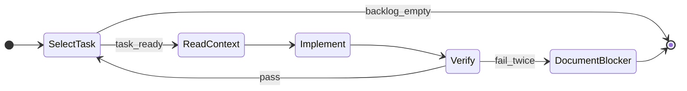

# Agent runbook: functional gap remediation

This document is the **version-controlled** counterpart to the Cursor plan “Functional Gap Analysis.” Use it to drive autonomous or semi-autonomous agents through the backlog in a safe order.

**Gap narrative (numbered issues 1–20)** lives in the Cursor plan file if you have it; this runbook focuses on **execution order**, **verification**, and **todo IDs**.

## Artifacts

| Artifact | Role |
|----------|------|
| This file | Wave order, gates, orchestration |
| Cursor plan `Functional Gap Analysis` | Full gap descriptions and optional frontmatter todos |
| Optional `AGENT_RUNLOG.md` (gitignored or committed) | One line per completed task: id, files, verify result |

## Operating model

Each iteration until the backlog is empty:

1. **Pick** the next ready task from the wave order below.
2. **Read** only files the task touches plus immediate callers/callees.
3. **Implement** the smallest change that closes the gap; follow existing patterns (`execute_query`, decorators, templates).
4. **Verify** using the wave gate (pytest, smoke, or manual steps).
5. **Record** task id, files changed, verification result (commit body or runlog).
6. **Stop** if the same failure happens twice after different fixes; document the blocker.

Avoid parallelizing tasks that touch the same file or the same migration unless branches merge in dependency order.

## Prerequisites (once)

- `python3` and `pytest` available; add minimal tests when fixing critical paths if coverage is missing.
- Clean tree or branch such as `fix/gap-analysis`.
- Optional: `DATABASE_PATH` pointing at a throwaway DB for migration experiments.

## Todo IDs and wave order

| Wave | Todo IDs | Notes |
|------|-----------|--------|
| **W0** | `critical-token-log`, `critical-before-request` | No dependencies. |
| **W1** | `critical-cascade` | Choose policy: e.g. refuse delete if any bookings exist, to avoid CASCADE wiping history. |
| **W2** | `critical-init-race` | [`backend/app.py`](../backend/app.py); multi-worker Gunicorn / empty DB race. |
| **W3** | `high-review-race` | `UNIQUE(booking_id)` + migration for duplicates. |
| **W4** | `high-calendar-mismatch`, `high-approve-recheck` | Align calendar with `check_availability`; recheck on approve. |
| **W5** | `high-inactive-adventure`, `high-adventure-capacity` | Inactive guard → per-date capacity → wrap validate+insert in `begin_immediate` (or equivalent). |
| **W6** | `medium-schema` | Remove `property_id DEFAULT 1`; add CHECK constraints; align `init_database` migrations. Adventure transaction belongs in W5 if not already done. |
| **W7** | `medium-session`, `medium-proxyfix` | Session regeneration, role sync, block self-suspend; `ProxyFix` / forwarded headers for external URLs (e.g. Koyeb). |
| **W8** | `low-ux` | Phone on profile, branding consistency, seed vs `LINKABLE_STAY_STATUSES`, availability fetch UI. |

**Single-agent recommended sequence:** W0 → W1 → W2 → W3 → W4 → W5 → W6 → W7 → W8.

## Per-task prompt template

```text
TASK: <todo id> — <one-line goal>
FILES: <explicit list>
DONE WHEN: <observable criterion>
VERIFY: <command or steps>
```

Example (`critical-token-log`):

- **DONE WHEN:** Logs never contain reset token or full reset URL.
- **VERIFY:** Grep auth controller for token in log calls; trigger forgot-password and inspect logs.

## Verification matrix

| After wave | Minimum verification |
|------------|----------------------|
| W0 | `pytest`; grep for sensitive log patterns removed |
| W1 | Property with only completed bookings: no silent mass delete, or explicit UX per policy |
| W2 | `gunicorn -w 2`, fresh `DATABASE_PATH`: single schema, no double seed |
| W3 | Double POST review → second fails cleanly |
| W4 | Overlapping pendings: second approve fails; calendar matches server for same property |
| W5 | Inactive adventure rejected; same-date participants cannot exceed max |
| W6 | Fresh DB + seed; existing DB migration path documented or scripted |
| W7 | New session after login; role visible in nav after DB change; HTTPS external URLs behind proxy (or test `X-Forwarded-Proto`) |
| W8 | Profile phone; single branding string; seed consistent with link rules; booking form shows load/error for availability |

## Multi-agent merge order

- **Agent A:** W0, W2, W7 (app, init, session, proxy).
- **Agent B:** W1, W4, W5 (models, booking, adventure).
- **Agent C:** W3, W6 (schema, migrations).

Merge **C before B** if B depends on new constraints; **A** can land last for ProxyFix/session once routes are stable.

Prefer **one commit per todo id** (or per wave) for bisect-friendly history.

## Failure and scope

- Do not hide migration failures with bare `except: pass`; document manual steps or add `scripts/` helpers.
- On product ambiguity, prefer the smallest change that prevents data loss and note alternatives in the runlog.
- No unrelated refactors in the same commits.

## State machine (reference)


